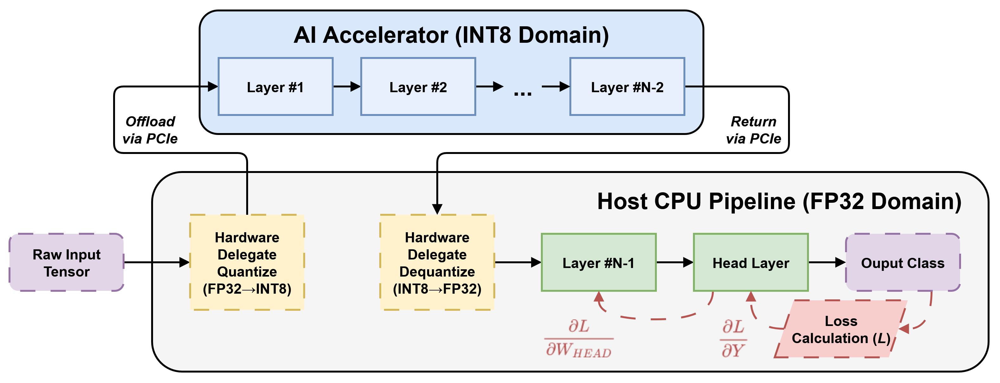
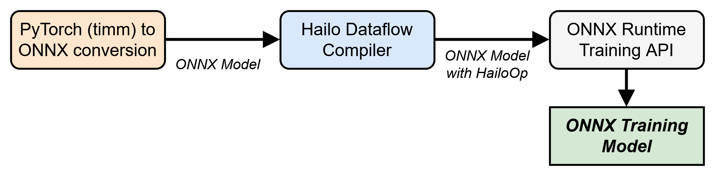
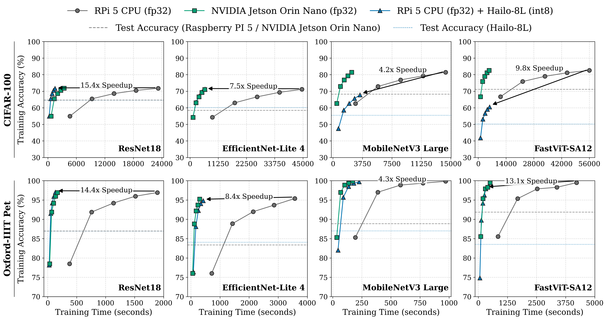
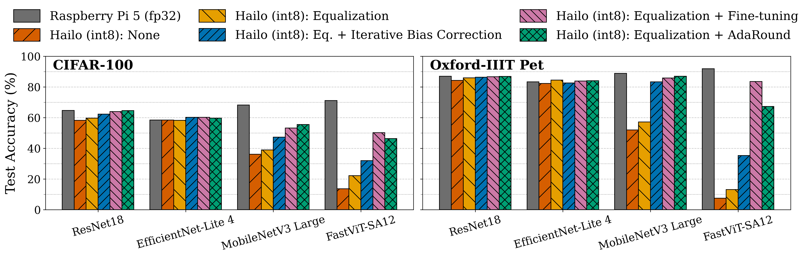

# Accelerated on-device training with edge AI accelerators

Accelerated on-device training pipeline with inference only edge AI (Hailo) co-processor. Project evaluates and compares the proposed workflow with common-purpose edge AI hardware, such as Raspberry Pi or GPU-based NVIDIA Jetson. Repository covers model preparation, conversion, on-device training, and runtime profiling.

<p align="center">
	
</p>

## Contents

- [Build](#build)
- [Conversion setup](#conversion-setup)
- [Model conversion](#model-conversion)
- [Runtime](#runtime)
	- [Jetson Orin Nano](#jetson-orin-nano)
	- [CPU-based devices (Raspberry Pi)](#cpu-based-devices-raspberry-pi)
- [On-device training](#on-device-training)
- [Results](#results)

References:

- [ONNX opset support](https://onnxruntime.ai/docs/reference/compatibility.html)
- [ONNX Runtime On-Device Training](https://onnxruntime.ai/docs/api/python/on_device_training/overview.html)

To simplify project reproduction, Python wheels for ONNX Runtime and PyTorch are available at [chmura.put.poznan.pl](https://chmura.put.poznan.pl/s/a5eKo8HkmTKDq3B) or at [project arrtifacts repository in Zenodo service](https://doi.org/10.5281/zenodo.20439109).

## Build

### Jetson Orin Nano

- JetPack: 6.2
- CUDA: 12.6
- Python 3.12.6

#### ONNX Runtime

- Source: [https://github.com/microsoft/onnxruntime](https://github.com/microsoft/onnxruntime)
- Branch: _v1.22.1_

**Build command:**

```shell
./build.sh --config Release --update --build --build_shared_lib --no_kleidiai --skip_tests --enable_training --build_wheel --use_cuda --cuda_home /usr/local/cuda   --cuda_version=12.6 --cudnn_home /usr/lib/aarch64-linux-gnu --parallel
```

### Hailo edge AI accelerator support

- Hailo accelerator
- HailoRT: 4.23.0 (pre-built packages, documentation and installtion steps are available at [https://hailo.ai/developer-zone/](https://hailo.ai/developer-zone/))
- Python 3.12.6

#### ONNX Runtime

- Source: [https://github.com/MatPiech/onnxruntime](https://github.com/MatPiech/onnxruntime)
- Branch: _v1.22.1-hailo_

**Build command:**

```shell
./build.sh --config Release --update --build --build_shared_lib --no_kleidiai --skip_tests --enable_pybind --build_wheel --use_hailo --enable_training --parallel --cmake_extra_defines CMAKE_POLICY_VERSION_MINIMUM=3.5
```

**References:**

- [ONNX Runtime with Hailo provider for on-device training](https://github.com/MatPiech/onnxruntime)
- [Hailo-8 Overview](https://hailo.ai/products/ai-accelerators/hailo-8-ai-accelerator/#hailo8-overview)

## Conversion setup

### Installation steps

To avoid conflicts between dependencies it is recommended to create two virtualenvs, e.g., `hailo` (conversion from ONNX to Hailo HAR and HEF formats) and `ort` (conversion from PyTorch to ONNX and generating ONNX Runtime training graphs).

**hailo virtualenv:**

1. Use Python 3.10 due to Hailo Dataflow Compiler Python bindings requirements.
2. Install HailoRT (4.23.0) and Hailo Dataflow Compiler (3.31.0) - follow the instructions at [https://hailo.ai/developer-zone/](https://hailo.ai/developer-zone/).
3. Install repository dependencies: `pip install -e .`

**ort virtualenv:**

1. Keep the same Python version (3.10) for compatibility with `hailo` virtualenv.
2. Install repository dependencies: `pip install -e .`
3. Build or install `onnxruntime-training` with HailoRT provider support to enable conversion of ONNX models with `HailoOp` to training graphs compatible with ONNX Runtime training APIs:

```shell
pip install onnxruntime_training-1.22.1+hailo*.whl
```

## Model conversion

Model conversion relies on the notebooks in `notebooks/` and the helper script `scripts/change_model_output_features.py`.

- Create a PyTorch model (from PyTorch Image Models - `timm`) and export to ONNX: `notebooks/create_onnx_model.ipynb` (`ort` virtualenv).
- Convert ONNX for Hailo (quantization/optimization): `notebooks/create_onnx_hailoop_model.ipynb` (`hailo` virtualenv).
- Generate training artifacts for ONNX Runtime: `notebooks/generate_training_graph.ipynb` (`ort` virtualenv).

The conversion flow typically produces artifacts under `artifacts/<model_name>/...` used by the runtime scripts.

<p align="center">
	
</p>

## Runtime installation

### Jetson Orin Nano

1. Use Python 3.12 with pip (preferably in a virtualenv).
2. Install project dependencies:

```shell
pip install -e .[jetson]
```

3. Build or install `onnxruntime-training` with CUDA support.

```shell
pip install onnxruntime_training-1.22.1+cu12*.whl
```

### CPU-based devices (Raspberry Pi)

1. Use Python 3.12 with pip (preferably in a virtualenv).
2. Install HailoRT and its Python bindings following the instructions at [https://hailo.ai/developer-zone/](https://hailo.ai/developer-zone/).
3. Install project dependencies:

```shell
pip install -e .[rpi]
```

4. Build or install `onnxruntime-training` package with hardware accelerator (CPU / Hailo depending on platform):

```shell
pip install onnxruntime_training-1.22.1+*.whl
```

## On-device training

### ONNX Runtime training

Run on-device training using ONNX Runtime training APIs:

```shell
python scripts/onnx_runtime_training.py \
	--model-dir <model-dir> \
	--data-path <dataset-path> \
	--device <cpu / cuda / hailo> \
	--epochs 1 \
	--batch-size 1 \
	--train
```

Use `--device cuda` on GPU-based Jetson or `--device hailo` with the Hailo provider when available.

### PyTorch training

For native PyTorch training on CPU or CUDA:

```shell
python scripts/pytorch_training.py \
	--model-path <model-file>.pth \
	--data-path <dataset-path> \
	--device <cpu / cuda> \
	--epochs 1 \
	--batch-size 1 \
	--train
```

## Results

> Training accuracy vs time curves for CIFAR-100 and Oxford-IIIT Pet across four models, comparing Raspberry Pi CPU, Jetson Orin Nano, and Raspberry Pi + Hailo-8L.

<p align="center">
	
</p>

> Bar charts comparing CIFAR-100 and Oxford-IIIT Pet test accuracy across models, showing how different Hailo int8 quantization and performance recovery strategies restore accuracy relative to Raspberry Pi fp32 baseline.

<p align="center">
	
</p>
